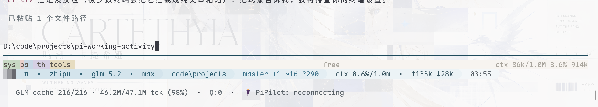
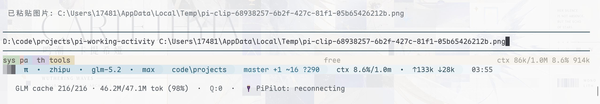

# pi-smart-paste

> Smart clipboard paste for [pi](https://github.com/earendil-works/pi-coding-agent) on **Windows**: copy a file → paste its **path**. Falls back to images.

[中文](#中文) · [English](#english)

---

## 中文

复制文件后，在 pi 输入框直接按 `Ctrl+V`，粘贴出来的是**文件路径**，而不是什么都没有。

### 为什么需要它

pi 内置的粘贴只处理**图片**。当你在资源管理器里复制一个**文件**，剪贴板里装的是「文件拖放列表」（既不是纯文本也不是图片），所以按 `Ctrl+V` 没反应——别的能粘文件的 harness 都是自己主动去读这个列表。

本扩展让粘贴变成**内容感知**的：

| 剪贴板内容 | 粘贴结果 |
|---|---|
| 复制的文件 | 文件绝对路径（多个每行一个） |
| 图片（截图 / 复制图片） | 保存为临时 png 并粘贴路径 |
| 都没有 | 提示用户 |

### 效果

**粘贴文件** → 直接得到文件路径（核心卖点）：



**粘贴图片** → 得到临时图片路径：



### 安装

```bash
# 从 GitHub
pi install git:github.com/ccch1mneyyy/pi-smart-paste
# 或从 npm
pi install npm:pi-smart-paste
```

### 配置（让 Ctrl+V / Alt+V 生效）

编辑 `~/.pi/agent/keybindings.json`，解绑内置的「只粘图片」动作，把这俩键交给本扩展：

```json
{ "app.clipboard.pasteImage": [] }
```

然后在 pi 里执行 `/reload`。

### 用法

| 触发方式 | 行为 |
|---|---|
| `Ctrl+V` / `Ctrl+Shift+V` / `Alt+V` | 智能粘贴（文件优先 → 图片） |
| `Ctrl+Shift+I` | 仅图片 |
| `/paste` | 智能粘贴（命令版） |
| `/paste-file` | 仅文件路径 |
| `/paste-image` | 仅图片 |

### 工作原理

用 STA 模式的 PowerShell **一次**探测剪贴板：先 `Clipboard.GetFileDropList()`（文件），再 `Clipboard.GetImage()`（图片）。输出强制 UTF-8，**中文路径不乱码**。

### 平台

仅 **Windows**（依赖 PowerShell + `System.Windows.Forms`）。

### 许可证

MIT © chimney

---

## English

Copy a file in Explorer, hit `Ctrl+V` in pi, and you get the **file path** instead of nothing.

### Why

pi's built-in paste only handles **images**. A copied **file** sits on the clipboard as a file-drop list (not text, not an image), so `Ctrl+V` is a no-op. This extension makes paste content-aware: **files → paths**, else **image**, else notify.

| Clipboard | Pasted |
|---|---|
| Copied file(s) | Absolute file path(s), one per line |
| Image (screenshot / copy) | Saved to temp png, path pasted |
| Neither | User is notified |

### Screenshots

**Paste a file** → get its path (the headline feature):


**Paste an image** → get the temp image path:


### Install

```bash
pi install git:github.com/ccch1mneyyy/pi-smart-paste
pi install npm:pi-smart-paste
```

### Setup

Clear the built-in image-only paste in `~/.pi/agent/keybindings.json` so `Ctrl+V` / `Alt+V` reach this extension:

```json
{ "app.clipboard.pasteImage": [] }
```

Then run `/reload` in pi.

### Usage

| Trigger | Behavior |
|---|---|
| `Ctrl+V` / `Ctrl+Shift+V` / `Alt+V` | Smart paste (files first → image) |
| `Ctrl+Shift+I` | Image only |
| `/paste` | Smart paste (command) |
| `/paste-file` | Files only |
| `/paste-image` | Image only |

### How it works

A single STA-mode PowerShell probe reads `Clipboard.GetFileDropList()` (files) then `Clipboard.GetImage()` (image), with UTF-8 output so non-ASCII paths survive.

### Platform

**Windows only** (PowerShell + `System.Windows.Forms`).

## License

MIT © chimney
